## Upplägg

### Vad vill vi veta om auktoritära regimer?
  
- **Del 1** Vad finns det för olika *former* och *typer* av auktoritära regimer? 
- *15 min paus*

- **Del 2** Varför håller fler och fler auktoritära regimer val?

- **Del 3** Informationsproblem och diktatorns dilemma

--

**Frågor är varmt välkomna!** 
---

### Varför ska vi studera auktoritära regimer?

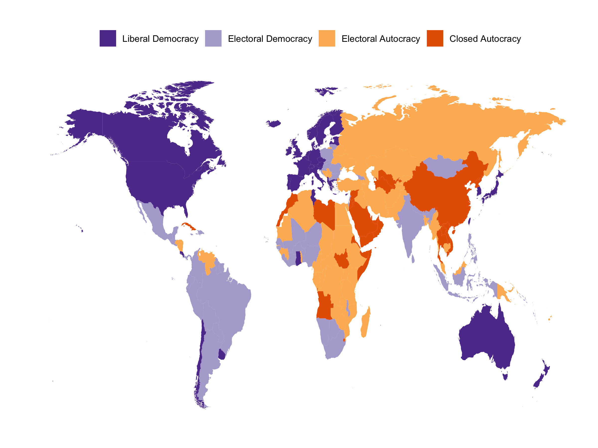
---

### 48 procent av världens befolkning bor idag i auktoritära regimer

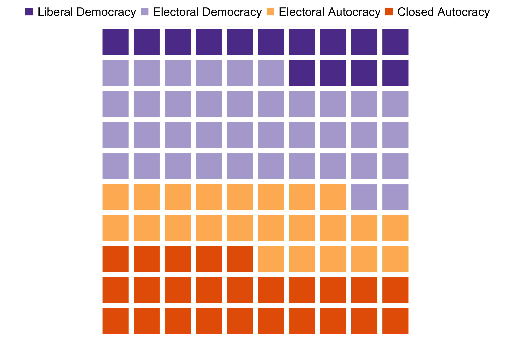

---
background-image: url(input/row.gif)
background-size: cover
class: center, bottom

--
Se själv: [RoW online map](https://tannenberg.shinyapps.io/regimes-of-the-world/)

---
### Varför är det viktigt att studera auktoritära regimer? 
En stor del av världens befolkning lever i olika former av auktoritära regimer, så det spelar roll. 

--

- Var, när och hur kan demokratibistånd fungera?

--

- Vilka interaktioner vill/ska vi ha med olika former av diktaturer - kulturellt, akademiska, handel (vapen?)

--

- Vissa tycks bra för mänsklig välfärd, andra inte alls. Varför?

--

- De flesta håller val, men är inte demokratiska. Hur skiljer vi dem från demokratier?

---

## Vad är en regim? 

#### Definitioner:
- "sets of formal and informal rules that structure the access to state power and its exercise" - Schedler (2013)
  
- "basic informal and formal rules that determine what interests are represented in the authoritarian leadership group and whether these interests can constrain the dictator" - Geddes (2014)

---

## Vad är en regim? 

#### Definitioner:
En regim är *inte* den grupp individer som sitter vid makten, utan de regler som styr makttillträde och kan alltså fortleva ledarskapsskiften. 

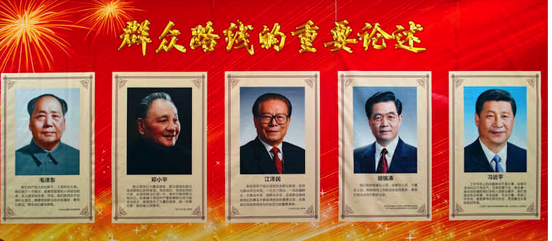

---

## Vad är en o-demokratisk regim?

- Där de styrande har kommit till makten genom *odemokratiska medel*, eller; 

- Kommit till makten genom demokratiska medel men ändrat de formella (eller informella) reglerna för att begränsa oppositionen i framtida val, eller; 

- Där militären hindrat politiska partier från att delta, och/eller, dikterar policy till sittande regering.  

--

Ett politiskt system där en (liten) grupp av individer utövar makt över staten utan att vara konstitutionellt ansvariga inför allmänheten. **Avsaknad av ansvarsutkrävande.** 

---

## Totalitära och Auktoritära regimer

**Totalitära** och **Auktoritära** regimer kan ses som **former** av odemokratiskt styrelseskick och är en distinktion av **hur** makten utövas. 

* Totalitära - ingen politisk pluralism; utopisk ideologi som ämnar absorbera och förändra samhälle, ekonomi och individ; massmobilisering, terror. Exempel: Nordkorea, Nazityskland, Kina under Mao, Sovjet under Stalin

--
  
* Auktoritära - begränsad politisk pluralism, ibland fritt civilsamhälle, ingen utopisk ideologi, ingen massmobilisering, våld och hot men inte systematisk terror Exempel: De flesta icke-demokratier

---

## Typer av auktoritära regimer

När vi talar om **typer** av o-demokratiska regimer är det en distinktion av **vem/vilka** som utövar makten. 

- Ett parti

- En militärjunta

- Ett kungahus

- En ledare

--

- Olika hybrider 

---
## Kompisövning 1

#### Vilken typ av auktoritär regim är mest respektive minst stabil? Och varför?

---

## Kompisövning 1 - svar: 
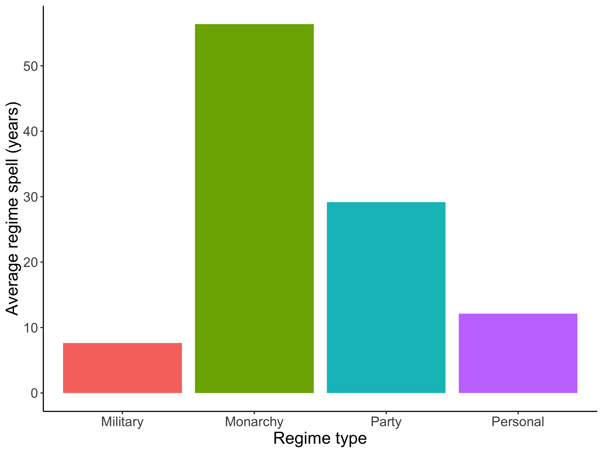

---

## Kompisövning 1 - svar:

Vilken typ av auktoritär regim är mest respektive minst stabil? Och varför?

* House of Al Said i Oman har styrt i **275 år** (1744-idag)

* Längst sittande diktator är Fidel Castro **52 år** (1959-2011)

* Utmanare - Kameruns Paul Biya med **42 år** and counting...

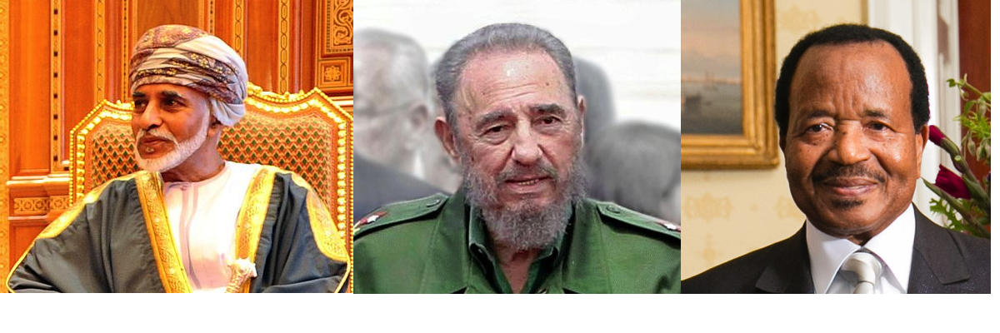

---

## Militärregimer 

En militärjunta styr, antingen med en general som statschef eller genom att kontrollera en civil regering med tunga poster, och påtryckningsmakt.

* Ofta ideologilös
  + Men nationalistisk, skyddar sin tolkning av nationens intresse 
* Framhäver ordning, stabilitet
* Hög våldskapacitet
* Legitimitets dilemma
* Arvsynd - hur hållbart är störst går först?
  + inbjuder utmanare

Exempel: Thailand, Egypten 

---

## Monarkier

Historiskt vanligast förekommande regimtyp. Den politiska makten utgår från ett kungahus. 

- Makten går i arv
- Legitimitet via kontinuitet, förmyndarskap från Gud. 
- Ättlingar till profeten
- Utmaning att bibehålla legitimitet när moderna värderingar sprids. Men motståndskraftiga under arabiska våren  

Exempel: Saudiarabien, Brunei, Oman, UAE, Jordanien

---
## Enpartiregimer

Enpartiregimer är de där ett politiskt parti dominerar den politiska arenan, såväl gällande utformning som utövning av politiken. Andra politiska partier kan vara tillåtna men är formellt eller informellt begränsade.  

* Legitimitet från frihetskrig
* Stark socialistisk eller kommunistisk ideologi (oftast)
* Folklig bas
* Allteftersom det revolutionära arvet mattas av behöver de prestera
* Fraktioner

Exempel: Kina, Kuba, Vietnam, Eritrea, Singapore

---
## Person-regimer

En person som kontrollerar allt. Kommer till makten via ett parti eller militären men samlar all politisk makt och försvagar/eliminerar utmanare. 

* Karisma, personkult
* Oklara regler för succession -> instabilitet

Exempel: Zimbabwe under Mugabe, Kina under Mao, Irak under Saddam, Uganda under Idi Amim

--

His Excellency President for Life, Field Marshal Al Hadji Doctor Idi Amin, VC, DSO, MC, CBE, Lord of all the Beasts of the Earth and Fishes of the Sea, and Conqueror of the British Empire in Africa in General and Uganda in Particular

---

## Kompisövning 2

### Hur skulle ni klassificera **Demokratiska Folkrepubliken Korea**?

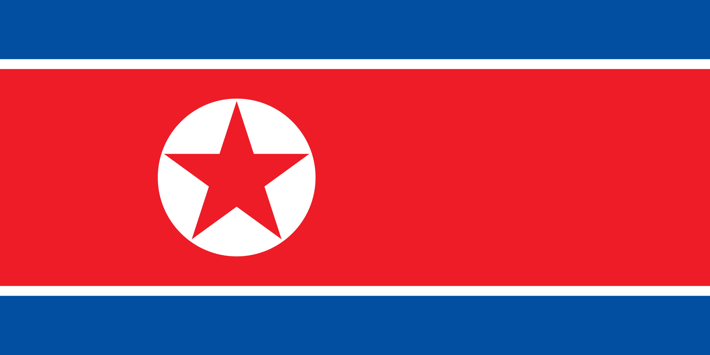

---

## Kompisövning 2

Hur skulle ni klassificera **Demokratiska Folkrepubliken Korea**?

- **Svar:** En totalitär, personstyrd, enparti-monarki???

Landet domineras av ett parti, där Kim Jong-Un är ordförande, men det råder en fullständig personkult, och nu har regimen klarat av tre maktskiften där ordförandeposten ärvts från far till son. Så det börjar likna en monarki. 

Ibland är det svårt! Men ofta användbart att klassificera regimer för att studera dem systematiskt.

---

## Geografisk spridning av auktoritära regimer 2010

---

## Geografisk spridning av auktoritära regimer 1970

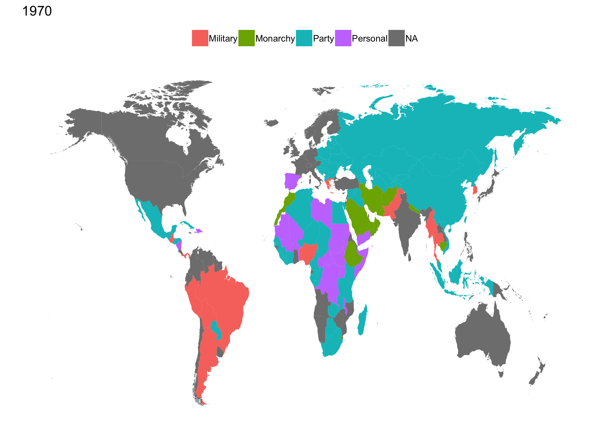

---

## Auktoritära regimer efter andra världskriget

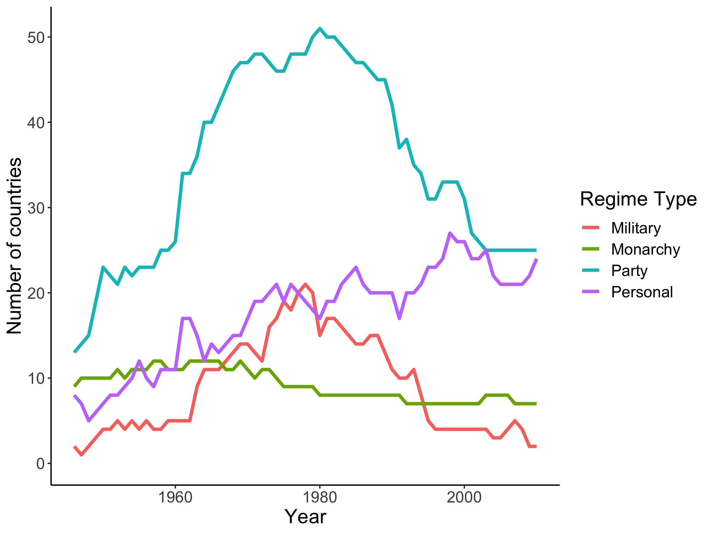

---

## Vilken typ är mest auktoritär?

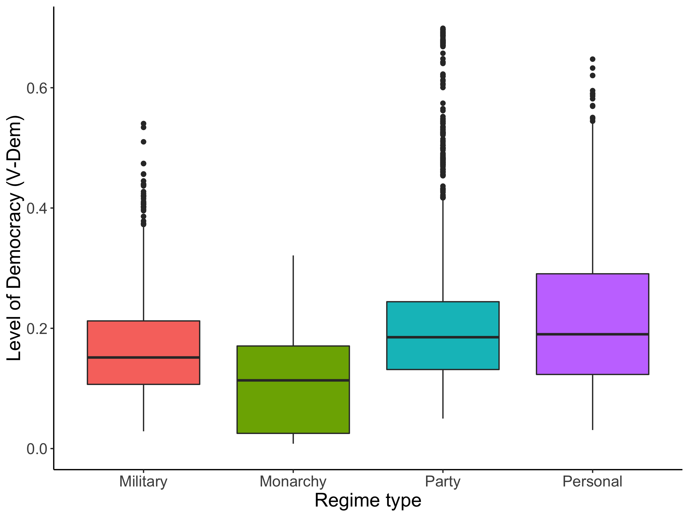

---
## Vad händer när en auktoritär regim faller?

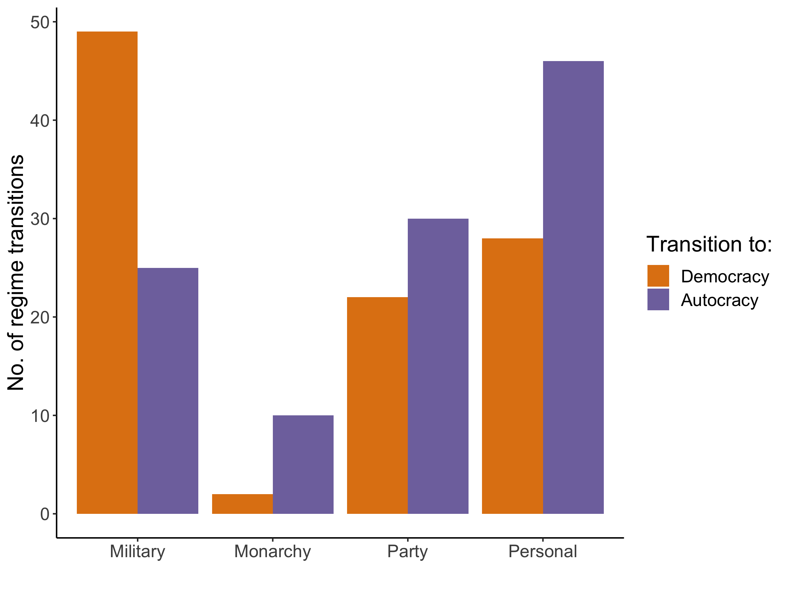

---

## Vad händer när en auktoritär regim faller?

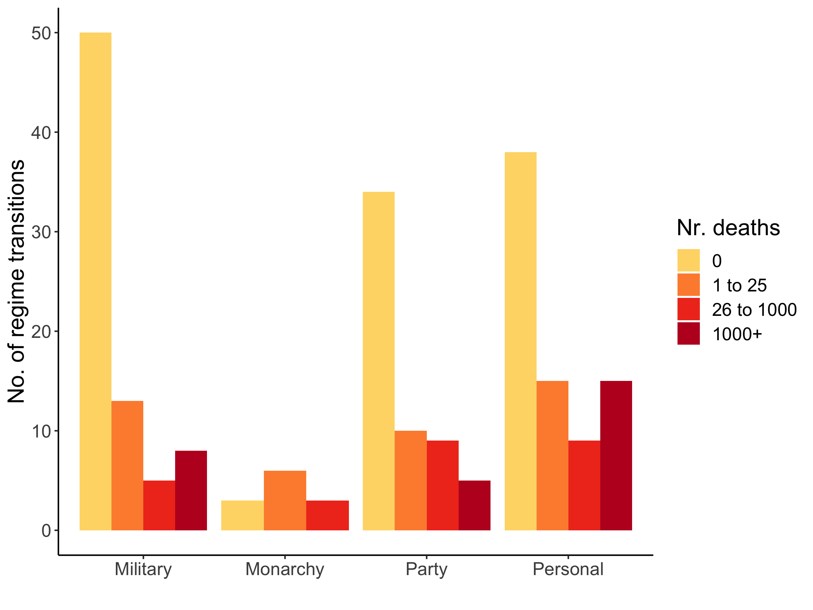

---

## Vad händer när en auktoritär regim faller?

Diktatorns öde beror på efterföljande regim

Post-Transition Fate | Autocracy  | Democracy 
---------------|---------------|-------------
Death | 14 |6
Jail | 22 | 11
Exile | 38 | 23
OK/Natural death | 27 | 60

Sources: GWF (2014) and Geomans et al (2009)

---

## Upplägg

- Del 1 Vad finns det för olika *former* och *typer* av auktoritära regimer? 
- **15 min paus**
- **Del 2** Varför håller fler och fler auktoritära regimer val?

- **Del 3** Informationsproblem och kontroll över media. 

---

class: center, middle

## Del 2: Auktoritära val

---

## En ny typ av regim - Electoral Autocracies

Idag håller de allra flesta regimer val. Endast ett tiotal gör inte det. 

Exempel: Saudiarabien, Kina, Qatar, Eritrea

- Men ofta är valen varken "fria eller rättvisa".

---

## Val i Nordkorea

- Valdeltagande i Nordkorea: 99.98%. 

- Rösterna är fördelade över fem partier - en demokrati? 

--

.pull-left[
- Alla partier ingår i alliansen "Democratic Front"

- *A voter may cross off the candidate's name to vote against him or her, but must do so with a red pen next to the ballot box in sight of electoral officials, or there may be a separate ballot box for 'no' votes* 
]

--

.pull-right[
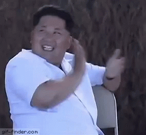
]

---

## Länder som inte pallar att hålla val

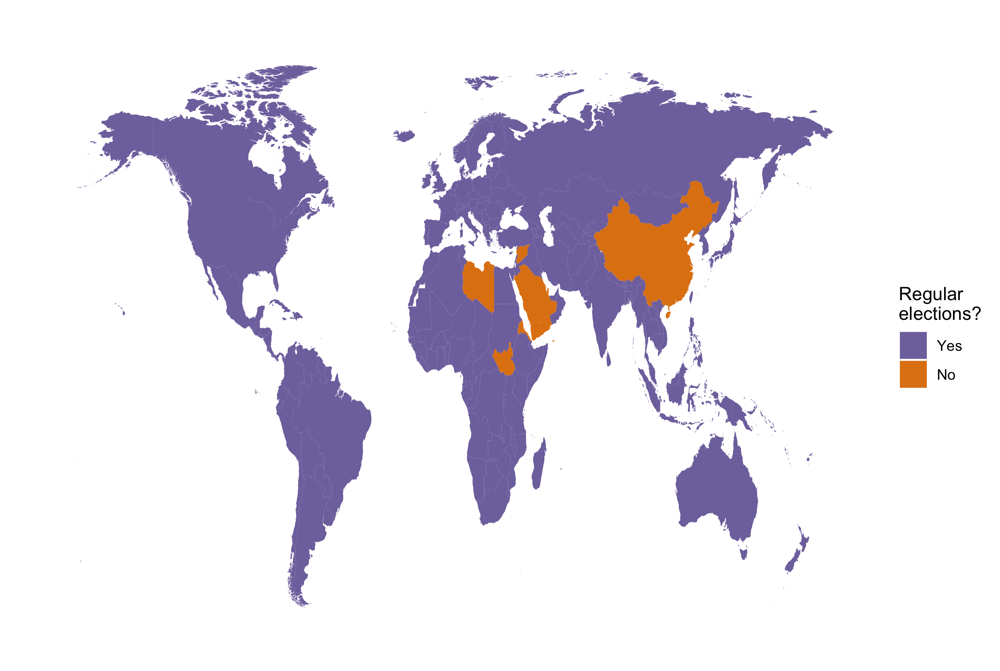

---

## Kompisövning 3

### Varför bryr sig auktoritära regimer om att hålla val?

---

## Kompisövning 3

### Varför bryr sig auktoritära regimer om att hålla val?

**Svar:** 

- Legitimitet - internationellt och nationellt

- Folkräkning

- Identifiera oliktänkande

- Signalpolitik

- Fördela makten - cooptation 

- Lokalt ansvarsutkrävande? 

---

## Men det är också riskfyllt att hålla val:

- Oppositionen kan förena sig - focal point

- Post election coup-d'etat

- Felbedömer sitt stöd 

- Negativa signaler

- Protester

---

## Hur vinner diktatorn "valet"?

*The menu of manipulation:* 

- Reservera viktiga beslutsfattande positioner och låta väljarna fylla ceremoniella eller oviktiga positioner
- Splittra/marginalisera oppositionen (politiska mord, förbjuda eller diskvalificerande kandidater eller utesluta dem via vallagar, tex "nationalitetsklausuler").
- Förhindra motståndarna att kampanja. Censur, förbjuda möten, mm
- Kontrollera förhindra väljarna att rösta genom registreringskrav, identifikationskrav, placering av röstkontor mm. 
- Skrämma väljargrupper genom (hot om) våld och/eller röstköp.
- Valfusk - vikta regimvänliga distrikt mer
- Hindra makttillträde om opposition vinner, eller tvinga de valda att agera som marionetter.

---

## En till regim-indelning

Förekomsten av manipulation ger en ytterligare indelning av regimer. Demokratier är endast de som uppfyller grundläggande demokratiska normer. Om minst en av dessa normer överträds, är regimen inte längre demokratisk.  

- Liberal Democracy - allt gott
- Electoral Democracy - uppfyller grundläggande principer men begränsat civilsamhälle och/eller avsaknad av kontroll av den exekutiva makten
- Competetive Autocracy - flerpartival men ojämna spelregler
- Hegemonic Autocracy - flerpartival men mycket ojämna spelregler
- Closed Autocracy - inga flerpartival

---

## Hur går det i valen? 
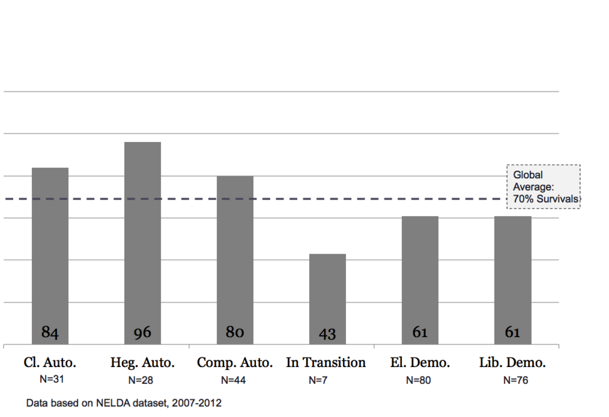

---

## Auktoritära regimer - upplägg

- Del 1 Vad finns det för olika former och typer av auktoritära regimer?
- Del 2 Varför håller fler och fler auktoritära regimer val?

- **Del 3 Informationsproblem och media**

---
class: center, middle

## Del 3: Diktatorns dilemma 

---

## Kompisövning 4

Hur mycket yttrandefrihet skulle du tillåta som diktator? 

---

## Auktoritära regimer och (o)fri media

I stort sett alla auktoritära stater styr över en statskontrollerad media. Men denna kan verka för sig själv (Nordkorea), eller tillsammans med "fri" media. För en diktator borde full kontroll över vilken information som sprids vara att föredra: 

- Vetskap om misskötsel, orättvisor, korruption kan leda till motstånd

- Oppositionen kan presentera ett alternativ till regimen

- Kan fungera som en plattform för att underminera regimen

--

Därför borde de flesta auktoritära regimer utöva hård censur. Men...

---

## Censur i auktoritära regimer 2017 - stor variation
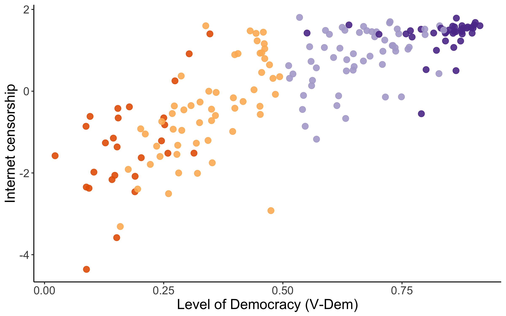

---

## Censur i auktoritära regimer 2010

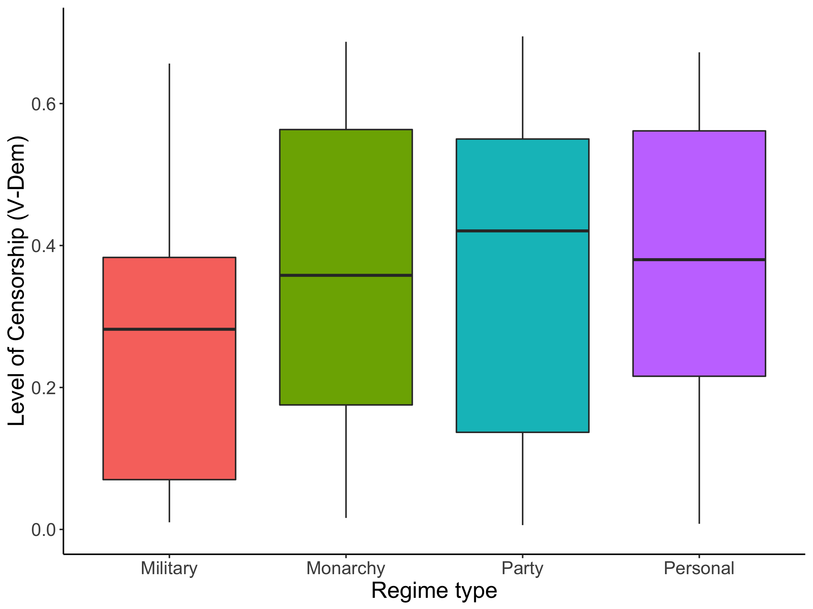

---

## Diktatorns dilemma

Diktatorns dilemma är att hen (han) är beroende av repression för att hålla kvar den politiska makten, vilket i sin tur gör att befolkningen döljer sina åsikter, vilket leder till ovisshet om opinionen mm. (Exempl: Ceaușescu). 

En (någorlunda) fri media kan hjälpa:

- förmedla kunskap om vad befolkningen efterfrågar - värdefullt för att kunna "köpa" stöd. 
- kontrollera korruption bland lägre tjänstemän - skatterna når inte till toppen. 
- vilka utvecklingsprogram fungerar/fungerar inte - information som byråkratin inte delger.

Detta leder till en balansgång mellan säkerhet och effektivitet. Men om regimen är under hot, alternativ är överöst med naturresurser är hård censur att föredra. 

---

## Vad har vi lärt oss idag?

- Odemokratiska stater ser olika ut, detta spelar roll.

- Val i odemokratiska stater är mer av regel än undantag

- Kan användas för att stärka auktoritära regimer, men kan också så fröet till deras undergång 

- Tryck- och yttrandefrihet är tveeggat svärd för auktoritära ledare. 

---

## Litteratur 

Läs först:

* Schedler, A. (2002). The menu of manipulation. Journal of democracy, 13(2), 36-50.
*	Geddes, B., Wright, J., & Frantz, E. (2014). Autocratic breakdown and regime transitions: A new data set. Perspectives on Politics, 12(02), 313-331
*	Egorov, G., Guriev, S., & Sonin, K. (2009). Why resource-poor dictators allow freer media: A theory and evidence from panel data. American political science Review, 103(04), 645-668.

I mån av tid:

- Knutsen, C. H., Nygård, H. M., & Wig, T. (2017). Autocratic elections: Stabilizing tool or force for change?. World Politics, 69(1), 98-143
-	Gerschewski, J. (2013). The three pillars of stability: legitimation, repression, and co-optation in autocratic regimes. Democratization, 20(1), 13-38.

---
class: center, middle

# Tack!

[marcus.tannenberg@gmail.com](marcus.tannenberg@gmail.com)

